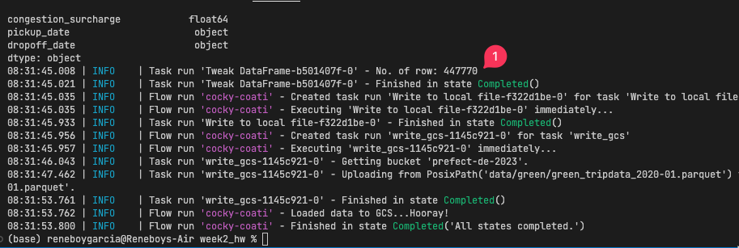
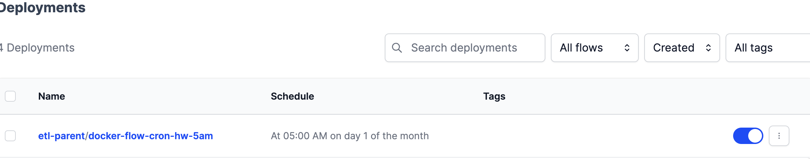
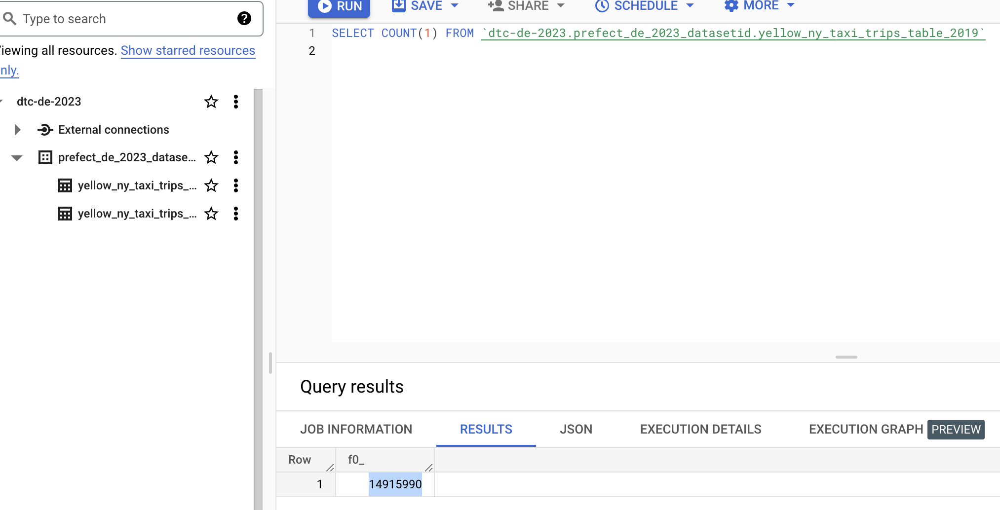
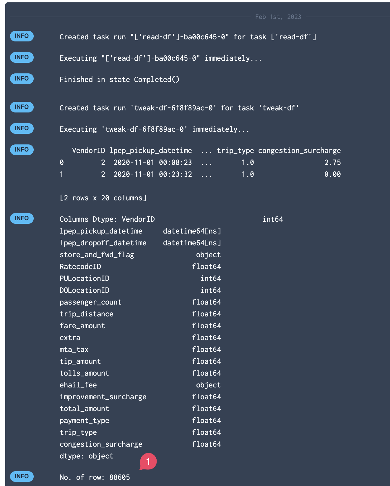
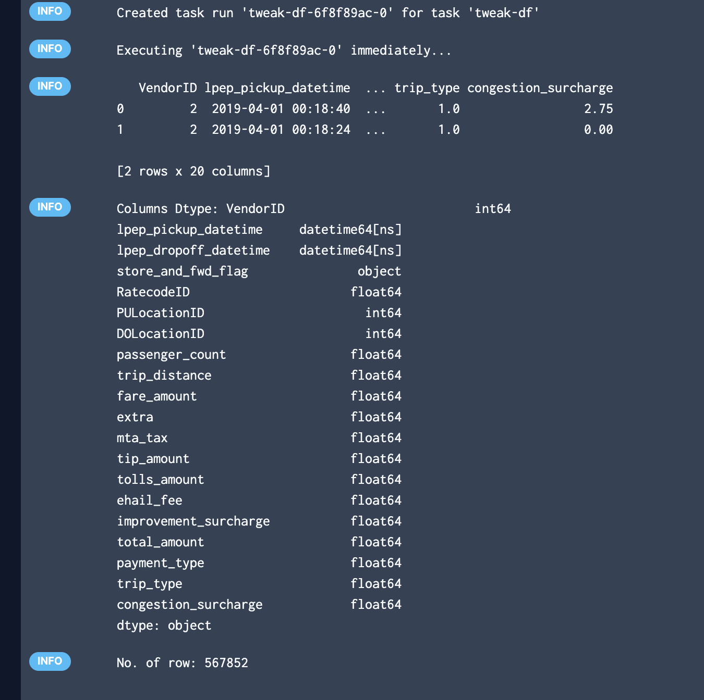
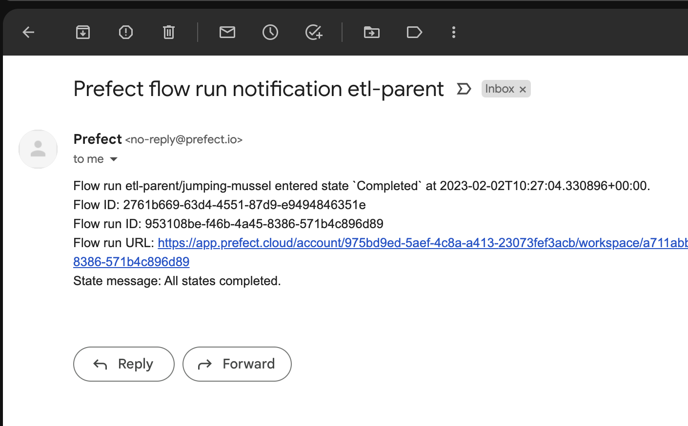
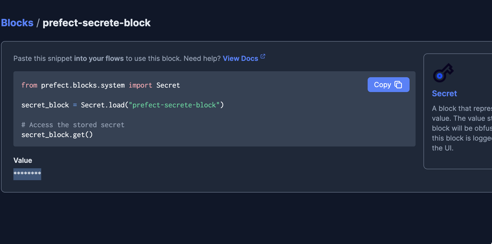

## Week 2 Homework

The goal of this homework is to familiarise users with workflow orchestration. 

## Question 1. Load January 2020 data

Using the `etl_web_to_gcs.py` flow that loads taxi data into GCS as a guide, create a flow that loads the green taxi CSV dataset for January 2020 into GCS and run it. Look at the logs to find out how many rows the dataset has.

How many rows does that dataset have?

* 447,770 `[ANSWER]`
* 766,792
* 299,234
* 822,132

## Question 2. Scheduling with Cron

Cron is a common scheduling specification for workflows. 

Using the flow in `etl_web_to_gcs.py`, create a deployment to run on the __first of every month at 5pm UTC__. What’s the cron schedule for that?

- `0 5 1 * *`
- `0 0 5 1 *`  `[ANSWER FOR 5AM]`
- `5 * 1 0 *`
- `* * 5 1 0`
- `0 17 1 * *`  `[ADDED FOR 5PM]`

## Question 3. Loading data to BigQuery 

Using `etl_gcs_to_bq.py` as a starting point, modify the script for extracting data from GCS and loading it into BigQuery. This new script should not fill or remove rows with missing values. (The script is really just doing the E and L parts of ETL).

The main flow should print the total number of rows processed by the script. Set the flow decorator to log the print statement.

Parametrize the entrypoint flow to accept a list of months, a year, and a taxi color. 

Make any other necessary changes to the code for it to function as required.

Create a deployment for this flow to run in a local subprocess with local flow code storage (the defaults).

Make sure you have the parquet data files for Yellow taxi data for Feb. 2019 and March 2019 loaded in GCS. Run your deployment to append this data to your BiqQuery table. How many rows did your flow code process?

- 14,851,920 `[14,915,990 | 2019_02-2019-03]`
- 12,282,990
- 27,235,753
- 11,338,483

[nyc_taxi](https://www.nyc.gov/site/tlc/about/tlc-trip-record-data.page)

## Question 4. Github Storage Block

Using the `web_to_gcs` script from the videos as a guide, you want to store your flow code in a GitHub repository for collaboration with your team. Prefect can look in the GitHub repo to find your flow code and read it. Create a GitHub storage block from the UI or in Python code and use that in your Deployment instead of storing your flow code locally or baking your flow code into a Docker image. 

Note that you will have to push your code to GitHub, Prefect will not push it for you.

Run your deployment in a local subprocess (the default if you don’t specify an infrastructure). Use the Green taxi data for the month of November 2020.

How many rows were processed by the script?

- 88,019
- 192,297
- 88,605 `[ANSWER]`
- 190,225

## Question 5. Email notifications

The hosted Prefect Cloud lets you avoid running your own server and has automations that allow you to get notifications when certain events occur or don’t occur. 

Create a free forever Prefect Cloud account at [app.prefect.cloud](https://app.prefect.cloud/) and connect your workspace to it following the steps in the UI when you sign up. 

Set up an Automation that will send yourself an email when a flow run succeeds. Run the deployment used in Q4 for the Green taxi data for April 2019. Check your email to see a success notification.

How many rows were processed by the script?

- `125,268`
- `377,922`
- `728,390`
- `514,392` `[567_852]`

## Question 6. Secrets

Prefect Secret blocks provide secure, encrypted storage in the database and obfuscation in the UI. Create a secret block in the UI that stores a fake 10-digit password to connect to a third-party service. Once you’ve created your block in the UI, how many characters are shown as asterisks on the next page of the UI (*).

- 5
- 6
- 8 `[********]`
- 10

## Submitting the solutions

* Form for submitting: TODO
* You can submit your homework multiple times. In this case, only the last submission will be used. Form for submitting homework 2: https://forms.gle/PY8mBEGXJ1RvmTM97

Deadline: 6 February (Monday), 22:00 CET

## Solution

We will publish the solution here